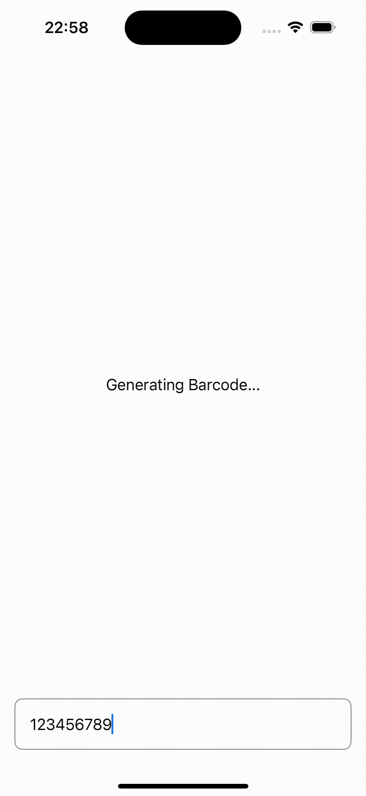

# barcode_example_ios

SwiftUIで作成したサンプルアプリで、12桁または13桁の数字を入力するとEAN13形式のバーコードを生成・表示します。

## 機能概要

- **EAN13バーコードの生成**
  12桁または13桁の数字を入力すると、自動的にEAN13形式のバーコードを生成します。
- **リアルタイム更新**
  入力欄に数字を変更するたびに、バーコードが即時更新されます。

## 使用ライブラリ

このアプリでは、[zxing-cpp](https://github.com/zxing-cpp/zxing-cpp) ライブラリを利用してバーコードの生成を実現しています。
zxing-cppは、高性能かつ柔軟なバーコード生成・読み取り機能を提供するC++ライブラリで、多くのバーコード形式に対応しています。

## 動作環境

- **開発環境**: Xcode 15.4
- **言語**: Swift, SwiftUI

